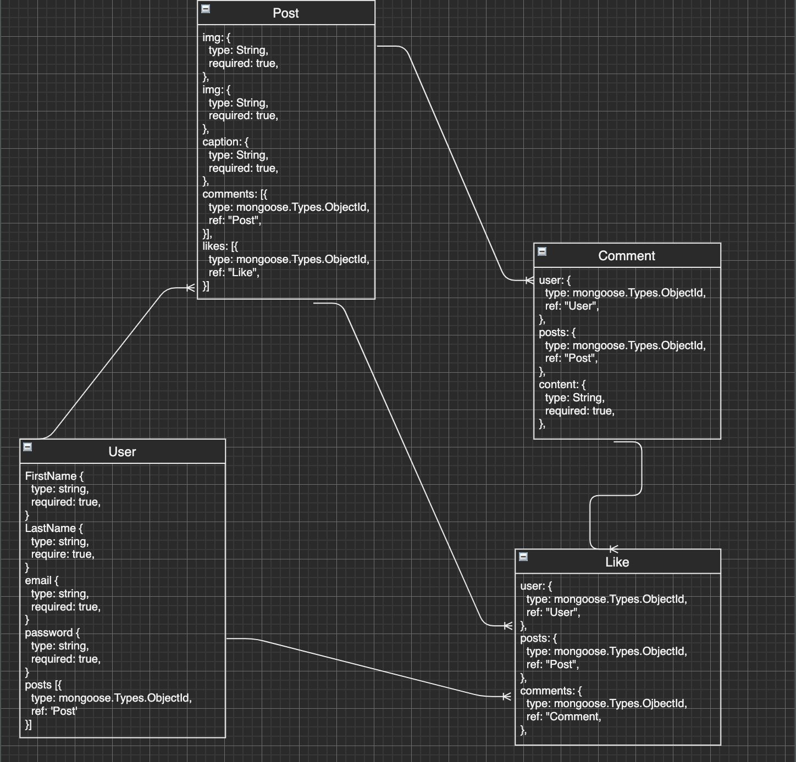

# Pic-less 

## Overview

In this app instance you will be able to share pictures you find around the web and have other people view, like and comment them. You will be asked to log in using your google account and it will then redirect you to the home screen.

From here on the top right corner you have the option to view your profile which will display your posts and the posts you've liked

By clicking on the Pic-Less logo on the top left you will be redirected back home, or you could always select Home from the drop down option in the top right.

Once a post has been made you have the option to edit or delete your posts. This will only be an available option if it's your post, otherwise you won't see the ellipses in the posts

You also have the option to click on the comments and add a comment and redirect to another user's profile by clicking on their name.

Have fun sharing pictures and comments with people!

## App Screenshots

## App ERD

## User Stories / Wireframe

- [Trello](https://trello.com/b/z3AqpP5F/unit-2-project)

## Technologies Used

  - Javascript
  - HTML
  - CSS
  - Mongoose
  - MongoDB
  - Express
  - Passport Google Oauth
  - EJS
  - Bootstrap
  - Popper

## Getting Started

Click on the link below to check out Pic-Less!

[Pic-Less](https://frozen-dawn-11241.herokuapp.com)

## Next Steps

A future step is going to be to have the ability to dislike a post, since once you like it it doesn't give you the option to delete the like

In addition, I would like to enable the <em>hide</em> feature (the eye with the slash), to be able to hide somebody's post when a user clicks on it. The post will be displayed to every user except the one that clicked on the eye.

Also, I would like to add an unhide function which undoes what the hide button does
